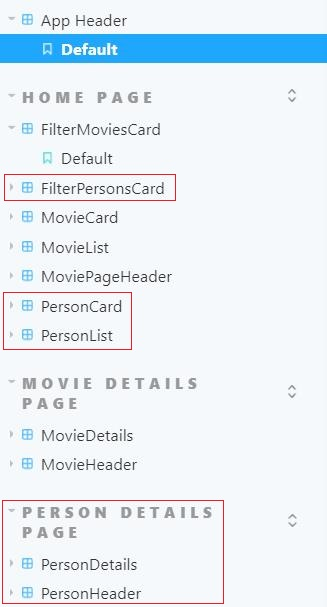
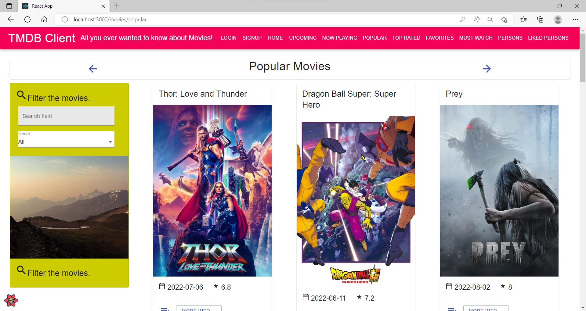
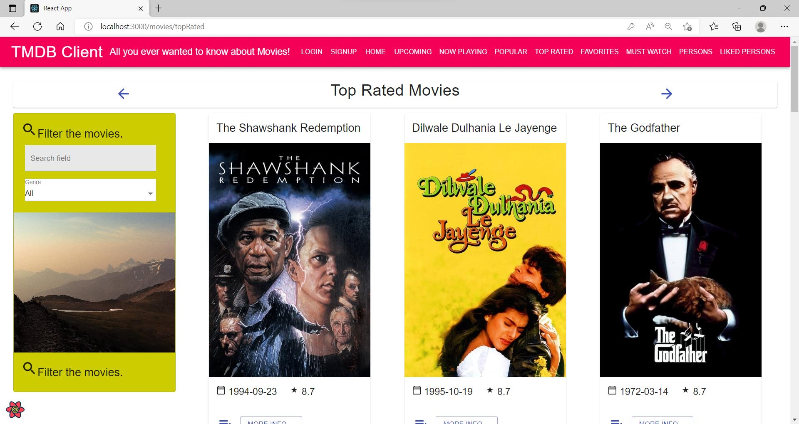
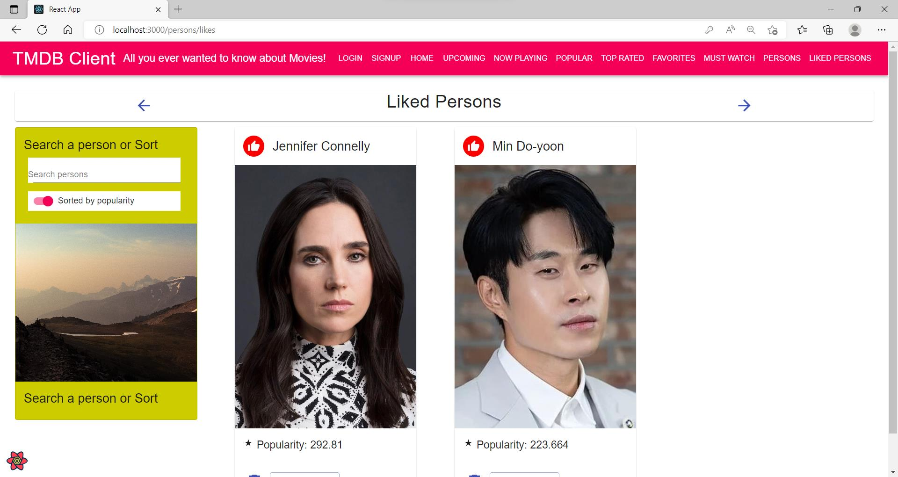
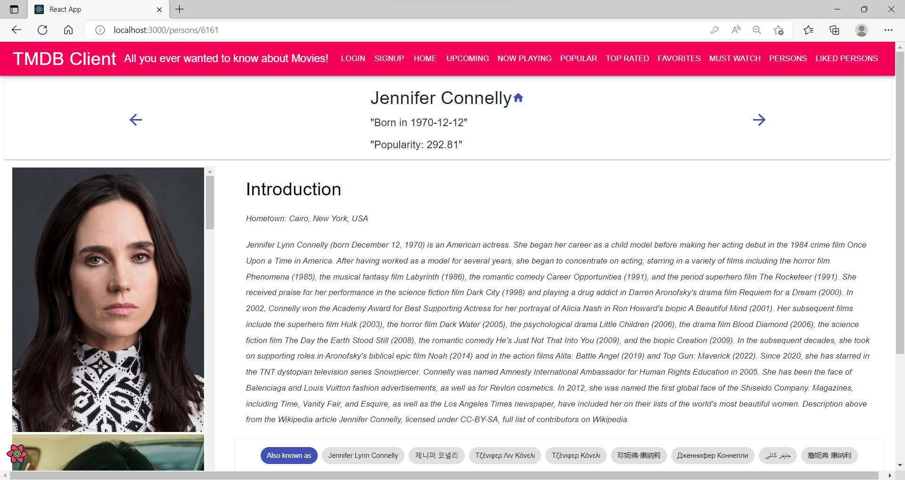
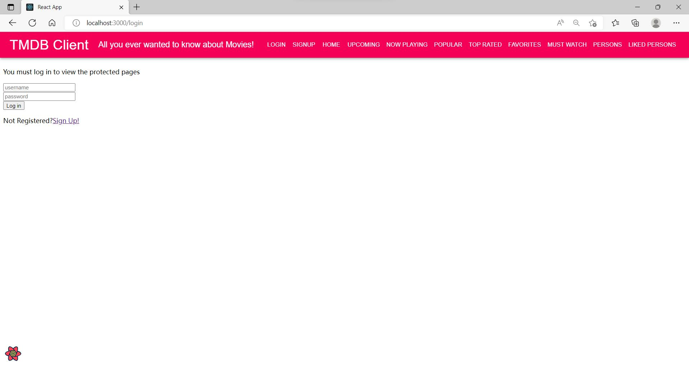

# Assignment 1 - ReactJS app.

Name: [Daijie Liu]

## Overview.

[A movie fan app using React framework.]

### Features.
[ A bullet-point list of the __new features__ you added to the Movies Fan app (and any modifications to existing features) .]
 
+ 7 new views
+ 6 new TMDB endpoints
+ Routing and parameterised URLs
+ Storybook support
+ Filtering and sorting
+ Full caching support
+ Authentication page

## Setup requirements.

[ Outline any non-standard setup steps necessary to run your app locally after cloning the repo.]

`npm install` to load reqiured packages.
`npm start` to start the app.
## API endpoints.

[ List the __additional__ TMDB endpoints used, giving the description and pathname for each one.] 

+ Get a list of movies in theatres - /movie/now_playing
+ Get a list of the current popular movies on TMDB - /movie/popular
+ Get the top rated movies on TMDB - /movie/top_rated
+ Get the list of popular people on TMDB - /person/popular
+ Get the primary person details by id - /person/{person_id}
+ Get the images for a person - /person/{person_id}/images

## App Design.

### Component catalogue.

[ A screenshot from the Storybook UI that lists all the stories for the app's components.]

### UI Design.

[ Screenshots of the __new/modified app pages__. ]

> Get a list of movies in theatres.

> Get a list of the current popular movies on TMDB.

> Get the top rated movies on TMDB.

> Get the list of popular people on TMDB and also click 'like' for them.

> Get a list of persons that was added in the liked list.

> Get details of a person by its id.

> The login page 

### Routing.

[ List the __new routes__ supported by your app and state the associated page.]

+ /movies/nowPlaying - displays a list of movies in theatres.
+ /movies/popular - displays a list of the current popular movies on TMDB.
+ /movies/topRated - displays the top rated movies on TMDB.
+ /persons - displays a list of popular people on TMDB.
+ /persons/likes - displays the liked persons list of this user.
+ /persons/{id} - displays the details of a person by its id.
+ /login - displays the login page.

[If relevant, state what aspects of your app are protected (i.e. require authentication) and what is public.]

## Independent learning (If relevant).

[ Itemize the technologies/techniques you researched independently and adopted in your project, i.e. aspects not covered in the lectures/labs. Include the source code filenames that illustrate these (we do not require code excerpts) and provide references to the online resources that helped you (articles/blogs).
